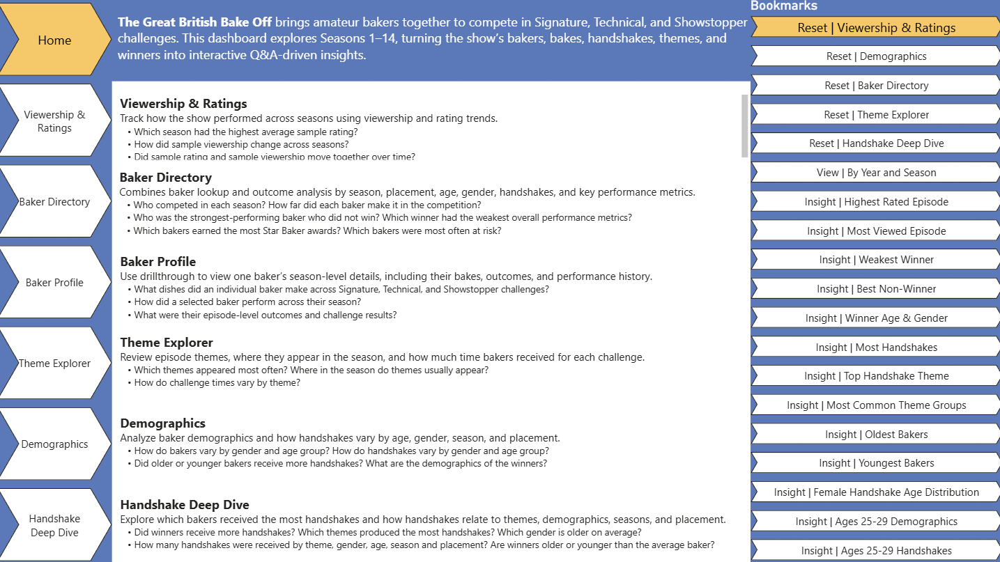
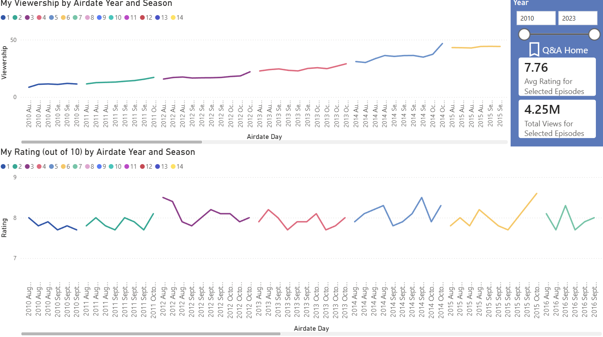
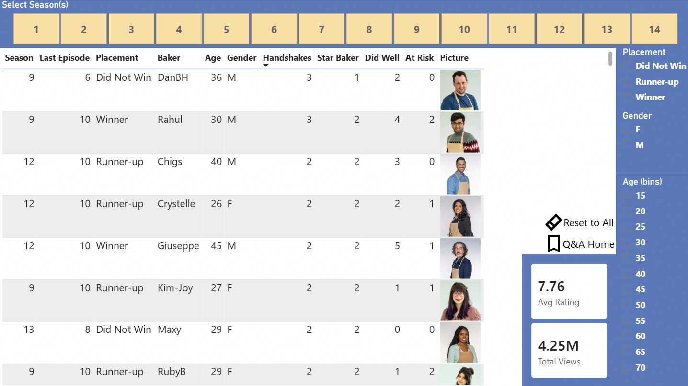
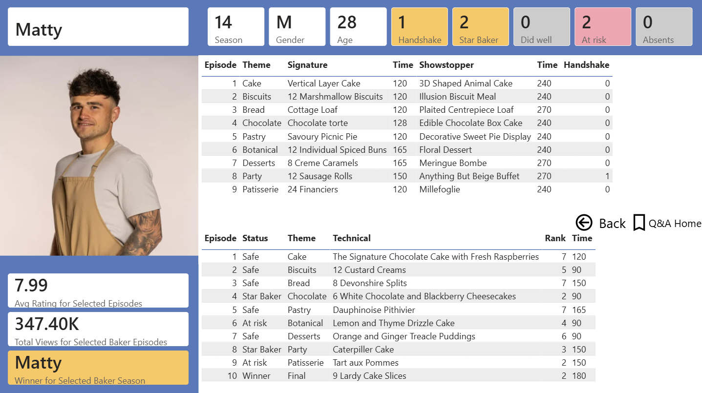
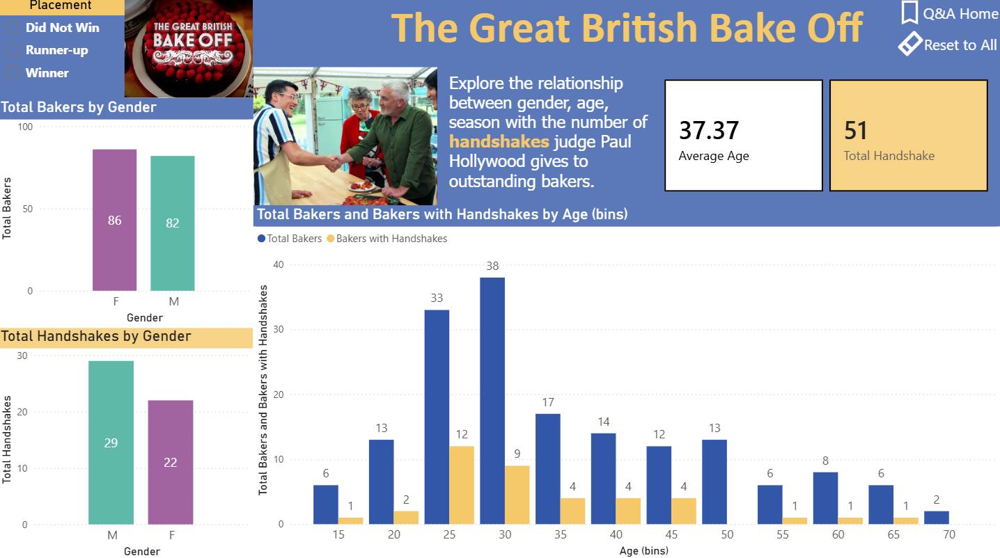
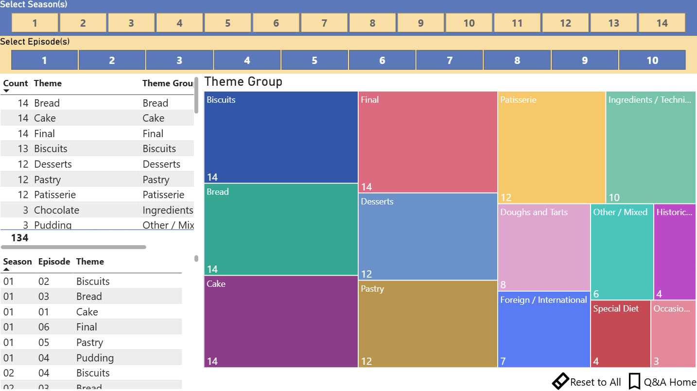
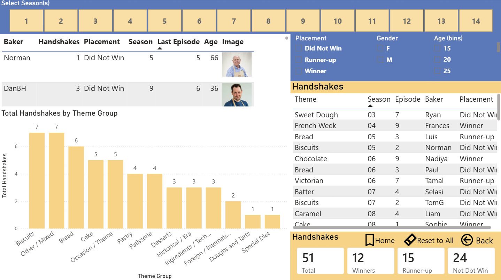
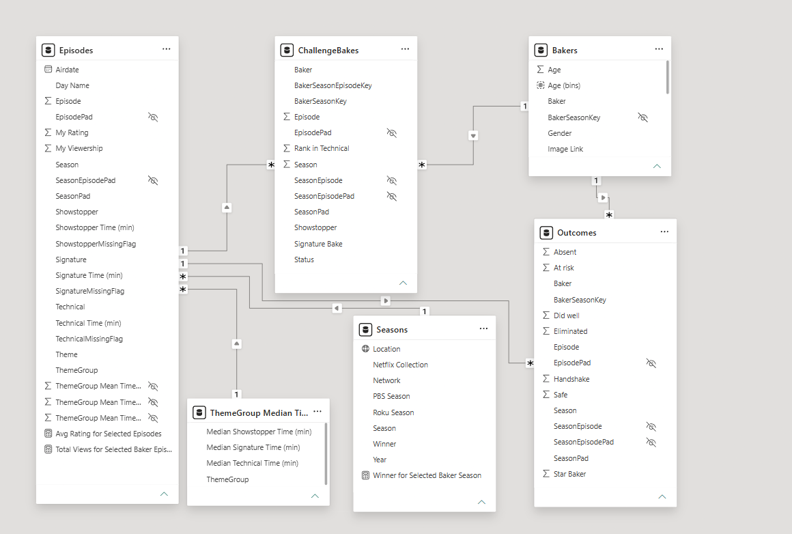

# Great British Bake Off Power BI Dashboard

## Project Overview

This Power BI dashboard explores *The Great British Bake Off* Seasons 1–14 through interactive analysis of bakers, outcomes, themes, sample ratings, sample viewership, and Paul Hollywood handshakes.

The goal of this project was to build a polished first Power BI dashboard that demonstrates data cleaning, relationship modeling, calculated measures, interactive report design, drillthrough navigation, bookmarks, and insight-focused storytelling.

## Links

* Reflection blog post: https://arayofdata.blogspot.com/2026/06/star-bakers-handshakes-and-dashboards.html
* GitHub repository: https://github.com/RayofData/The-Great-British-Bake-Off-Dashboard/tree/main/dashboard
* Youtube demo: https://youtu.be/M9G9CqhxZq0

## Dashboard Preview

The dashboard is organized into a Home page plus six report pages. It moves from guided Q&A navigation into detailed analysis of bakers, ratings, viewership, themes, demographics, outcomes, and Paul Hollywood handshakes.

| Page                     | Purpose                                                                                                                           |
| ------------------------ | ----------------------------------------------------------------------------------------------------------------------------------|
| **Home**                 | Q&A-style landing page with navigation buttons, reset buttons, and bookmark-driven sample questions.                              |
| **Viewership & Ratings** | Reviews sample rating and viewership trends across seasons and episodes.                                                          |
| **Baker Directory**      | Combines baker lookup and outcome analysis, including season, placement, demographics, handshakes, and key performance metrics.   |
| **Baker Profile**        | Uses drillthrough to show one baker’s season-level profile, bakes, outcomes, ratings, viewership, and final placement.            |
| **Demographics**         | Analyzes bakers by age, gender, placement, and handshake-related demographic patterns.                                            |
| **Theme Explorer**       | Explores episode themes, theme groups, challenge timing, and where themes appear within seasons.                                  |
| **Handshake Deep Dive**  | Focuses on handshake recipients and patterns by baker, theme group, placement, season, age, and gender.                           |

### Screenshots















## Key Features

* Home page with Q&A-style navigation and bookmark-driven guided views
* Six report pages, including a drillthrough Baker Profile page
* Baker Directory page for contestant lookup and outcome analysis
* Season, placement, gender, and age filtering
* Separate demographic and handshake deep-dive views for baker and handshake analysis
* Custom DAX measures and calculated columns for placements, outcomes, handshakes, ratings, and viewership
* Power Query transformations for theme grouping, missing-value handling, and cleaned supporting tables
* Theme-level analysis for challenge timing and handshake patterns

## Analytical Questions

This dashboard was designed to answer both fan-focused and analytical questions.

### Ratings and Viewership

* Which season had the highest average sample rating?
* How did sample viewership change across seasons?
* Did sample rating and sample viewership move together over time?

### Baker Participation and Outcomes

* Who competed in each season?
* How far did each baker make it in the competition?
* Which bakers earned the most Star Baker awards?
* Which bakers were most often at risk?
* Who was the strongest-performing baker who did not win?
* Which winner had the weakest overall performance metrics?

### Baker Profiles

* What dishes did an individual baker make across Signature, Technical, and Showstopper challenges?
* How did a selected baker perform across their season?
* What were their episode-level outcomes and challenge results?

### Theme and Challenge Trends

* Which episode themes appeared most often?
* Where in the season did different themes usually appear?
* How do challenge times vary by theme group?

### Demographic Trends

* How do bakers vary by gender and age group?
* How do handshakes vary by gender and age group?
* Are there visible age or gender patterns among handshake recipients?
* Has the number of handshakes changed across seasons?
* Which gender is older on average?
* Are winners older or younger than the average baker?

### Handshake Analysis

* Which bakers received the most Paul Hollywood handshakes?
* Did winners receive more handshakes than non-winners?
* How were handshakes distributed across winners, runner-ups, and non-winners?
* Which themes produced the most handshakes?

## Tools Used

* **Power BI Desktop**: Built the interactive dashboard, including visuals, slicers, bookmarks, drillthrough pages, and report navigation.
* **Power Query**: Cleaned and transformed the data, including data type changes, grouping, merging, theme grouping, and missing-value handling.
* **DAX**: Created calculated columns and measures for placements, outcomes, handshakes, ratings, viewership, and dashboard metrics.

## Dataset

This project uses the **Great British Bake Off sample dataset** from Tableau’s public sample data collection.

Source: [Tableau Sample Data](https://public.tableau.com/app/learn/sample-data)

The dataset includes five related CSV files:

| Table            | Description                                                                                                                  |
| ---------------- | ---------------------------------------------------------------------------------------------------------------------------- |
| `Bakers`         | Contestant-level data, including season, baker name, age, gender, and image link.                                            |
| `ChallengeBakes` | Baker-level challenge records by season and episode, including Signature, Showstopper, Technical rank, and status.           |
| `Episodes`       | Episode-level data, including airdate, theme, challenge descriptions, challenge times, sample rating, and sample viewership. |
| `Outcomes`       | Baker outcome records by episode, including Star Baker, eliminated, did well, safe, at risk, absent, and handshake fields.   |
| `Seasons`        | Season metadata, including hosts, judges, location, network, winner, year, and streaming labels.                             |

Note: `MyRating` and `MyViewership` are artificial sample-data fields, so related insights should be interpreted as dashboard-practice trends rather than real-world audience metrics.

## Data Preparation

The project began by loading all five CSV files into Power BI and recreating the table relationships using season, episode, baker, and combined key fields.

Key preparation steps included:

* Created custom keys such as `BakerSeasonKey`, `BakerSeasonEpisodeKey`, and `SeasonEpisodePad` to support filtering across tables.
* Created a cleaned distinct season table by removing host and judge columns from `Seasons`, then removing duplicate season rows.
* Set baker image links to the **Image URL** data category.
* Manually grouped detailed episode themes into broader `ThemeGroup` categories.
* Created a theme-group median time table to support missing challenge-time fills.
* Added flag columns to identify which challenge-time values were originally missing.
* Filled missing Signature, Technical, and Showstopper challenge times using the median time for the matching theme group and challenge type.
* Created calculated fields for placement, last episode reached, total handshakes, Star Baker counts, “did well” counts, and “at risk” counts.

## Data Model

The dashboard uses a relational model connecting the five original dataset tables with supporting calculated tables and custom keys. The model supports analysis across multiple levels of detail, including season, episode, baker, baker-season, and baker-episode records.



The model was designed to support cross-filtering, drillthrough navigation, and DAX measures across baker outcomes, challenge bakes, themes, ratings, viewership, and handshakes.

## Key Findings

* **Highest-rated season:** Season 5 had the highest average `MyRating`, with an average score of **8.10**.
* **Most-viewed episode in the sample:** The **Season 7 finale** had the highest sample `MyViewership`, with **57.47K total views**.
* **Winner age comparison:** Winners averaged **33 years old**, compared with **37.3 years old** across all bakers.
* **Bakers with the most handshakes:** **DanBH** and **Rahul** from Season 9 received the most handshakes, with **3 handshakes each**.
* **Strongest-performing non-winner:** **Jürgen** from Season 12 stood out as the strongest-performing non-winner. He earned **3 Star Baker awards**, received **3 Did Well placements**, was **never marked At Risk**, but did not make it to the final.
* **Winner with the weakest performance metrics:** **Jon** from Season 3 had the weakest winner performance based on the selected metrics, with **1 Star Baker award**, **1 Did Well placement**, and **3 At Risk placements**.
* **Handshake distribution by gender and age:** Male bakers received **29 handshakes**, while female bakers received **22 handshakes**. Overall baker age distribution peaked in the **30 age bin**, while handshake frequency peaked in the **25 age bin**.
* **Themes most associated with handshakes:** **Biscuits** had the most handshakes, with **7 total**. All biscuit handshakes occurred in Episode 2 of their respective seasons and none of the bakers won.
* **Most common theme groups:** **Bread, Cake, Biscuits, and Final** appeared in every season.

## Known Limitations

* `MyRating` and `MyViewership` are artificial sample-data fields and do not represent real-world audience ratings or viewership.
* Missing challenge times were filled using median values by theme group and challenge type.
* Flag columns identify which challenge-time values were originally missing before imputation.
* Some analysis depends on calculated fields created from available outcome data, so results reflect the structure and completeness of the sample dataset.

## Repository Structure

```text
gbbo-powerbi-dashboard/
│
├── README.md
├── dashboard/
│   └── gbbo_dashboard.pbix
│
├── screenshots/
│   ├── model.png
│   ├── home.png
│   ├── viewership_ratings.png
│   ├── baker_directory.png
│   ├── baker_profile.png
│   ├── theme_explorer.png
│   ├── demographics.png
│   ├── handshake_deep_dive.png
│   ├── most_views.png
│   ├── hightest_rating.png
│   ├── biscuits_handshakes.png
│   ├── baker_profile_jurgen.png
│   ├── handshake_deep_dive_season9.png
│   ├── viewership_ratings_by_year.png
│   ├── The_Great_British_Bake_Off_title.jpg
│   └── handshake.webp
│
├── docs/
│   ├── dax_measures.md
│   ├── power_query_notes.md
│   └── dashboard_pages.md
│
├── data/
│   ├── GBBO Data Set - GBBO_Data_Dictionary.pdf
│   ├── Bakers.csv
│   ├── ChallengeBakers.csv
│   ├── Episodes.csv
│   ├── Outcomes.csv
│   └── Seasons.csv
```

## Documentation

Additional technical documentation is available in the `docs/` folder:

https://github.com/RayofData/The-Great-British-Bake-Off-Dashboard/tree/main/docs

* `dax_measures.md`: Key measures and calculated columns
* `power_query_notes.md`: Data cleaning and transformation steps
* `dashboard_pages.md`: Summary of report pages and interactions

## Credits and Data Sources

Dataset: [Tableau Sample Data](https://public.tableau.com/app/learn/sample-data)

This project uses Tableau’s Great British Bake Off sample dataset for educational and portfolio purposes. The dataset is provided for educational use and does not imply endorsement from Love Productions, Ltd., The Great British Bake Off, Tableau, or related parties.
