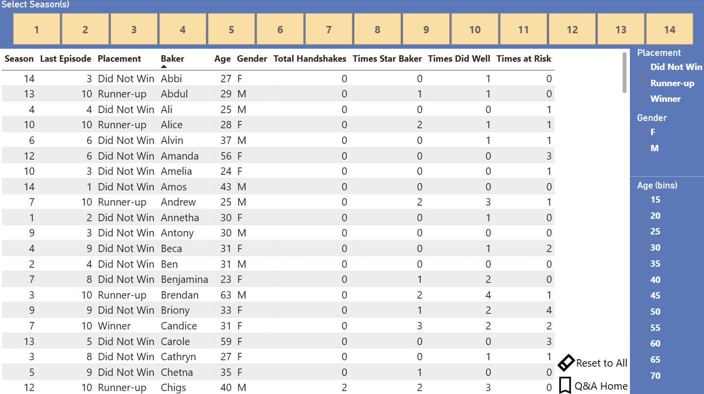

# Great British Bake Off Power BI Dashboard

## Project Overview

This Power BI dashboard explores *The Great British Bake Off* Seasons 1–14 through interactive analysis of bakers, outcomes, themes, ratings, viewership, and Paul Hollywood handshakes. The project uses Power BI, Power Query, DAX, drillthrough pages, bookmarks, and guided Q&A navigation to turn fan-focused show data into a structured analytics dashboard.

The goal of this project was to build a polished first dashboard that demonstrates data cleaning, relationship modeling, calculated measures, interactive report design, and insight-focused storytelling.

## Live Dashboard and Links

* Interactive Power BI dashboard:
* Blog post:
* GitHub repository:

## Dashboard Preview

The dashboard is organized into guided pages that move from high-level exploration to detailed baker, outcome, theme, and handshake analysis.

| Page                       | Purpose                                                                                                      |
| -------------------------- | ------------------------------------------------------------------------------------------------------------ |
| **Home**                   | Q&A-style landing page with navigation buttons and guided sample questions.                                  |
| **Baker Directory**        | Explore bakers by season, placement, age, gender, and winner status.                                         |
| **Baker Profile**          | Drill through to a single baker’s season-level profile, bakes, outcomes, and performance history.            |
| **Viewership & Ratings**   | Review sample rating and viewership trends across seasons and episodes.                                      |
| **Handshake Demographics** | Analyze handshakes by age, gender, season, and placement.                                                    |
| **Baker Outcomes**         | Compare Star Baker awards, times at risk, final placements, and other performance outcomes.                  |
| **Theme Explorer**         | Explore episode themes, theme groups, challenge timing, and where themes appear in the season.               |
| **Handshake Deep Dive**    | Investigate which bakers received handshakes and how handshakes relate to theme, placement, age, and gender. |

### Screenshots





## Analytical Questions

This dashboard was designed to answer both fan-focused and analytical questions, including:

* Who competed in each season, and how far did each baker make it?
* Which bakers were the oldest and youngest?
* Which bakers earned the most Star Baker awards?
* Which bakers were most often at risk?
* Who was the strongest-performing baker who did not win?
* Which winner had the weakest overall performance metrics?
* Which season had the highest average rating?
* How did sample viewership change across seasons?
* Which bakers received the most Paul Hollywood handshakes?
* Did winners receive more handshakes than non-winners?
* How do handshakes vary by age, gender, placement, and theme?
* Which episode themes appeared most often?
* How do challenge times vary by theme group?

## Tools Used

* **Power BI Desktop**: Built the full interactive dashboard, including visuals, slicers, bookmarks, drillthrough pages, and report navigation.
* **Power Query**: Cleaned and transformed the data, including data type changes, grouping, merging, theme grouping, and missing-value handling.
* **DAX**: Created calculated columns and measures for placements, outcomes, handshakes, ratings, viewership, and dashboard metrics.

## Dataset

This project uses the **Great British Bake Off sample dataset** from Tableau’s public sample data collection.

Source: [Tableau Sample Data](https://public.tableau.com/app/learn/sample-data)

The dataset includes five related CSV files:

| Table            | Description                                                                                                                  |
| ---------------- | ---------------------------------------------------------------------------------------------------------------------------- |
| `Bakers`         | Contestant-level data, including season, baker name, age, gender, and image link.                                            |
| `ChallengeBakes` | Baker-level challenge records by season and episode, including Signature, Showstopper, Technical rank, and status.           |
| `Episodes`       | Episode-level data, including airdate, theme, challenge descriptions, challenge times, sample rating, and sample viewership. |
| `Outcomes`       | Baker outcome records by episode, including Star Baker, eliminated, did well, safe, at risk, absent, and handshake fields.   |
| `Seasons`        | Season metadata, including hosts, judges, location, network, winner, year, and streaming labels.                             |

Note: `MyRating` and `MyViewership` are artificial sample-data fields, so related insights should be interpreted as dashboard-practice trends rather than real-world audience metrics.

## Data Preparation

The project began by loading all five CSV files into Power BI and recreating the table relationships using season, episode, baker, and combined key fields.

Key preparation steps included:

* Created custom keys such as `BakerSeasonKey` and `SeasonEpisode` to support filtering across tables.
* Created a cleaned distinct season table by removing host and judge columns from `Seasons`, then removing duplicate season rows.
* Set baker image links to the **Image URL** data category.
* Manually grouped detailed episode themes into broader `ThemeGroup` categories.
* Created a theme-group median time table to support missing challenge-time fills.
* Filled missing Signature, Technical, and Showstopper challenge times using the median time for the matching theme group and challenge type.
* Added one minute to filled time values to mark them as imputed, since original challenge times generally ended in `0` or `5`.
* Created calculated fields for placement, last episode reached, total handshakes, Star Baker counts, “did well” counts, and “at risk” counts.

## Key Features

* Multi-page interactive Power BI dashboard
* Q&A-style home page navigation
* Drillthrough baker profile page
* Bookmark-driven guided views
* Season-level filtering
* Custom DAX measures and calculated columns
* Power Query transformations and missing-value handling
* Theme grouping for higher-level analysis
* Handshake analysis by baker, age, gender, theme, season, and placement

## Key Findings

To be completed after final dashboard validation.

Suggested findings to include:

* Highest-rated season
* Season or episode with highest sample viewership
* Baker with the most handshakes
* Strongest-performing non-winner
* Winner with the weakest performance metrics
* Gender or age group patterns in handshake distribution
* Themes most associated with handshakes
* Most common theme groups

## Known Limitations

* `MyRating` and `MyViewership` are artificial sample-data fields and do not represent real-world audience ratings or viewership.
* Missing challenge times were filled using median values by theme group and challenge type.
* Filled challenge-time values were marked by adding one minute, making imputed values identifiable but slightly altering the displayed time.
* Some analysis depends on calculated fields created from available outcome data, so results reflect the structure and completeness of the sample dataset.

## Repository Structure

```text
gbbo-powerbi-dashboard/
│
├── README.md
├── dashboard/
│   └── gbbo_dashboard.pbix
│
├── screenshots/
│   ├── home.png
│   ├── baker_directory.png
│   ├── baker_profile.png
│   ├── viewership_ratings.png
│   ├── handshake_demographics.png
│   ├── baker_outcomes.png
│   ├── theme_explorer.png
│   ├── handshake_deep_dive.png
|   ├── The_Great_British_Bake_Off_title.jpg
|   └── handshake.webp
│
├── docs/
│   ├── dax_measures.md
│   ├── power_query_notes.md
│   └── dashboard_pages.md
│
└── data/
│   ├── GBBO Data Set - GBBO_Data_Disctinary.pdf
│   ├── Bakers.csv
│   ├── ChallegeBakers.csv
│   ├── Episodes.csv
│   ├── Outcomes.csv
│   └── Season.csv
```

## Documentation

Additional technical documentation is available in the `docs/` folder:

* `dax_measures.md`: Key measures and calculated columns
* `power_query_notes.md`: Data cleaning and transformation steps
* `dashboard_pages.md`: Summary of report pages and interactions

## Future Improvements

* Finalize and document the corrected data model.
* Add a short video walkthrough of dashboard navigation.
* Add more detailed validation checks for major metrics.
* Improve visual consistency across all pages.
* Expand the blog post with findings, design decisions, and lessons learned.

## Credits and Data Sources

Dataset: [Tableau Sample Data](https://public.tableau.com/app/learn/sample-data)

This project uses Tableau’s Great British Bake Off sample dataset for educational and portfolio purposes. The dataset is provided for educational use and does not imply endorsement from Love Productions, Ltd., The Great British Bake Off, Tableau, or related parties.
